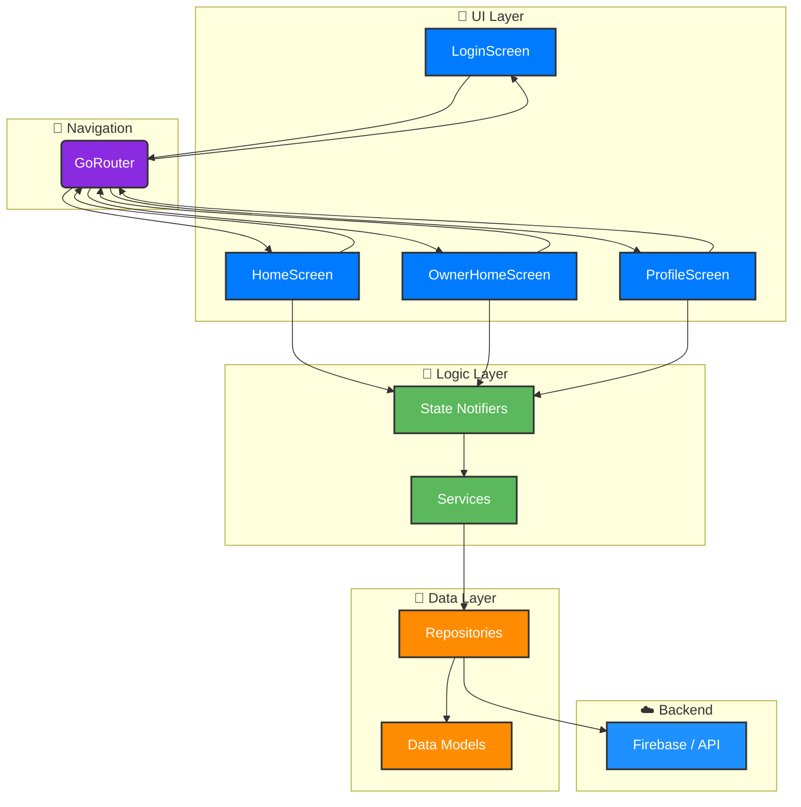

# Cancha-Now
### Tu Cancha. Tus Reglas. Tu App.

  

    
    
    
    

---

## 🤔 **¿Qué es Cancha-Now?**

**Cancha-Now** es la solución definitiva para modernizar el mundo de las reservas deportivas. Es un ecosistema digital completo construido en **Flutter** que ofrece una experiencia de usuario premium, fluida y profesional, con interfaces separadas y optimizadas para **Jugadores** y **Propietarios** de canchas.

 

## ✨ **¿Por Qué Cancha-Now?**

<table width="100%">
  <tr>
    <td align="center" width="33%">
      
      <h3>Diseño de Élite</h3>
      
Interfaces premium con foco en la experiencia de usuario.

    </td>
    <td align="center" width="33%">
      
      <h3>Multiplataforma Nativo</h3>
      
Un solo código base para un rendimiento excepcional en iOS, Android y Web.

    </td>
    <td align="center" width="33%">
      
      <h3>Arquitectura Escalable</h3>
      
Construido para crecer, fácil de mantener y expandir con nuevas funciones.

    </td>
  </tr>
</table>

---

##  галерея: Un Vistazo por Dentro

<table width="100%">
  <tr>
    <td align="center">
      <h4>Login Moderno</h4>
      
    </td>
    <td align="center">
      <h4>Panel de Propietario</h4>
      
    </td>
    <td align="center">
      <h4>Detalles de Cancha</h4>
      
    </td>
  </tr>
</table>

---

## 🚀 **Stack Tecnológico de Vanguardia**

  <i>Solo las mejores herramientas para un producto de primera.</i>

  
  
  
  
  

---

<h3>🏗️ Ver Arquitectura del Proyecto</h3>

 

---

  <h2>¿Listo para empezar?</h2>
  
Clona el repositorio y lleva la gestión de canchas al siguiente nivel.

  <pre><code>git clone https://github.com/tu-usuario/cancha-now.git && cd cancha-now && flutter pub get && flutter run</code></pre>

