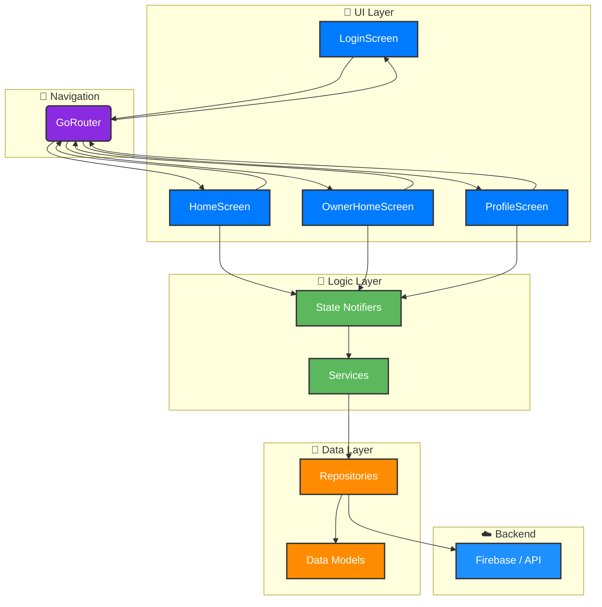

# Cancha-Now

> Tu Cancha. Tus Reglas. Tu App.

---

### **El Manifiesto**

**Cancha-Now** nace de una convicción: la tecnología debe ser una extensión de nuestra pasión. Creemos en un mundo donde el acceso al deporte es instantáneo, la gestión de espacios es inteligente y la experiencia de usuario es, en sí misma, una victoria. 

Este no es solo un proyecto en Flutter. Es nuestra visión de cómo la simpleza, el diseño y una arquitectura robusta pueden transformar una industria.

---

### **Filosofía de Diseño y Construcción**

Construimos **Cancha-Now** sobre tres pilares innegociables:

*   **✨ Diseño de Élite:** La función y la forma son inseparables. Cada pixel, cada animación y cada flujo están diseñados para ser intuitivos, eficientes y estéticamente impecables. La interfaz no es solo un medio, es la experiencia.

*   **🚀 Rendimiento Nativo Multiplataforma:** Una única base de código, un rendimiento sin concesiones. Gracias a Flutter, ofrecemos una experiencia nativa y fluida en iOS, Android y la Web, garantizando velocidad y fiabilidad en cualquier dispositivo.

*   **🏗️ Arquitectura Pensada para el Futuro:** Diseñamos un sistema escalable y mantenible desde el núcleo. Una arquitectura limpia que nos permite innovar a gran velocidad, añadir nuevas funcionalidades y asegurar la estabilidad del producto a largo plazo.

---

### **Stack Tecnológico Curado**

> Solo las mejores herramientas para un producto destinado a liderar.

- **Framework:** Flutter
- **Lenguaje:** Dart
- **Navegación:** Go Router
- **Estilo:** Google Fonts

---

<details>
<summary><strong>Ver Arquitectura del Proyecto</strong></summary>
<br>



</details>

---

### **Lanzamiento Inmediato**

> Clona, instala y ejecuta. Todo en una sola línea.

```bash
git clone https://github.com/tu-usuario/cancha-now.git && cd cancha-now && flutter pub get && flutter run
```
